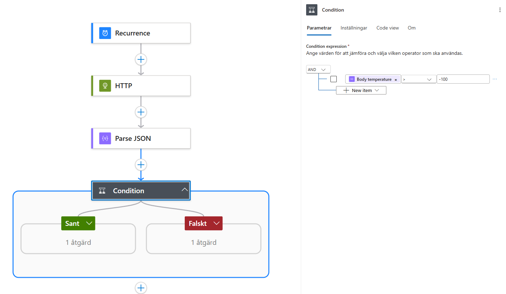

# Azure Weather Data Integration
Azure Logic Apps | REST API | Blob Storage | ARM Template


This project demonstrates an Azure Logic App integration that retrieves weather data from a public REST API on a scheduled basis. The workflow parses and validates the JSON response, stores valid data in Azure Blob Storage, and handles invalid responses with structured error handling.

---

## Architecture

The integration follows a simple serverless workflow built with Azure Logic Apps.

Recurrence Trigger  
→ HTTP Request to Weather API  
→ Parse JSON  
→ Condition Validation  
→ Store Data in Azure Blob Storage  
→ Error Handling with Terminate




---

## Technologies

- Azure Logic Apps
- Azure Blob Storage
- REST API integration
- JSON parsing
- Conditional logic
- Error handling
- Infrastructure as Code (ARM template)

- ---

## Features

- Scheduled weather data retrieval
- Integration with external REST API
- JSON response parsing
- Data validation using conditional logic
- Blob storage persistence
- Structured error handling

---

## Deployment

The Logic App can be deployed using the provided ARM template.

```bash
az deployment group create \
--resource-group <resource-group> \
--template-file logic-app/template.json \
--parameters logic-app/parameters.json
```
